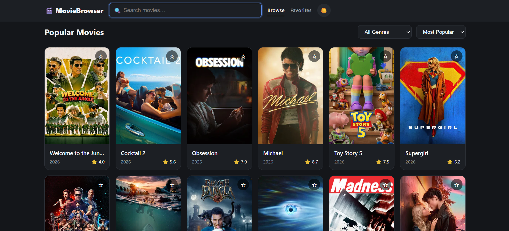

<div align="center">

# 🎬 Movie Browser — React Movie Discovery App

**A responsive movie discovery web app built with React — search, filter, and save favorite movies using the TMDB API.**

[](https://react.dev)
[](https://www.themoviedb.org/documentation/api)
[](https://reactrouter.com)
[](https://vercel.com)

</div>

---

## 📸 Preview

> *Browse popular movies, search instantly, filter by genre, and save favorites — light and dark mode included*



---

## ✨ Features

- 🔍 **Live Search** — debounced search across TMDB's full movie catalog
- 🎭 **Genre & Sort Filters** — filter by genre, sort by popularity, rating, or release date
- ⭐ **Favorites** — save movies to a persistent favorites list using localStorage
- 🎬 **Detail View** — modal with overview, runtime, genres, rating, and top cast
- ⏳ **Loading, Error & Empty States** — skeleton loaders, retry on failure, friendly empty states
- 🌗 **Dark / Light Mode** — theme toggle with system-preference detection, persisted across visits
- 📱 **Fully Responsive** — adapts cleanly from mobile to desktop
- 🧩 **Reusable Component Library** — Button, Card, Modal, and Input components shared across the app
- 📄 **Pagination** — browse through TMDB's full result set page by page

---

## 🚀 Live Demo

**[→ View Movie Browser](https://movie-browser-khaki-seven.vercel.app/)**

---

## 🗂️ Project Structure

```text
movie-browser/
│
├── src/
│   ├── api/
│   │   └── tmdb.ts                  # TMDB API client (search, discover, genres, details)
│   ├── hooks/
│   │   ├── useDebounce.ts           # Debounced search input
│   │   ├── useFavorites.ts          # Favorites state synced to localStorage
│   │   └── useTheme.ts              # Dark/light theme state + persistence
│   ├── components/
│   │   ├── Button/                  # Reusable Button component
│   │   ├── Card/                    # Reusable Card component
│   │   ├── Input/                   # Reusable Input component
│   │   ├── Modal/                   # Reusable Modal component
│   │   ├── Header/                  # Sticky nav + search bar
│   │   ├── Filters/                 # Genre + sort dropdowns
│   │   ├── MovieCard/                # Movie poster card with favorite toggle
│   │   ├── MovieGrid/                # Responsive grid of MovieCards
│   │   ├── MovieDetailModal/        # Full movie details modal
│   │   └── States/                  # Loading, error, and empty state UI
│   ├── pages/
│   │   ├── BrowsePage.tsx           # Search, filter, and discover movies
│   │   └── FavoritesPage.tsx        # Saved favorite movies
│   ├── styles/
│   │   ├── theme.css                 # CSS variables for light/dark themes
│   │   └── global.css                # Base + layout styles
│   ├── App.tsx                       # Routes + top-level state
│   └── main.tsx                      # App entry point
│
└── .env                              # TMDB API key (not committed)
```

---

## 🏁 Getting Started

```bash
# 1. Clone the repository
git clone https://github.com/Samiullah-2004/movie-browser.git

# 2. Navigate into the project
cd movie-browser

# 3. Install dependencies
npm install

# 4. Set up environment variables
# Create a .env file in the root with:
# VITE_TMDB_API_KEY=your_tmdb_api_key

# 5. Run the dev server
npm run dev
```

Then open [http://localhost:5173](http://localhost:5173) in your browser.

> Get a free TMDB API key at [themoviedb.org/settings/api](https://www.themoviedb.org/settings/api) — use the **API Key (v3 auth)** value.

---

## 🛠️ Tech Stack

| Technology | Purpose |
|---|---|
| **React** | Component-based UI |
| **Vite** | Frontend build tool and dev server |
| **React Router DOM** | Client-side routing (Browse / Favorites) |
| **TMDB API** | Movie data, search, genres, and details |
| **CSS Variables** | Theming for dark/light mode |
| **localStorage** | Persisting favorites and theme preference |

---

## 🔌 API Usage (TMDB)

```text
GET /discover/movie         Browse popular movies with genre/sort filters
GET /search/movie           Search movies by title
GET /movie/:id              Get movie details, credits, and videos
GET /genre/movie/list        Get list of genres for filtering
```

---

## 🚢 Deployment

- **Hosting** — deployed on **Vercel**
- **Build Command** — `npm run build`
- **Output Directory** — `dist`

Environment variable required on Vercel:
- `VITE_TMDB_API_KEY`

---

## 👤 Author

**Samiullah Akram**
Full Stack MERN Developer from Lahore, Pakistan 🇵🇰

[](https://github.com/Samiullah-2004)
[](https://www.linkedin.com/in/samiullah-akram-a28461404/)
[](https://instagram.com/_s_a_m_i_u_l_l_a_h_)
[](mailto:samiullahmuhammadakram@gmail.com)

---

## 📄 License

This project is open source and free to use for personal and educational purposes.
If you use this as a reference or template, a credit would be appreciated! 🙏

---

<div align="center">

**Built with 💙 by Samiullah — 2026**

</div>
